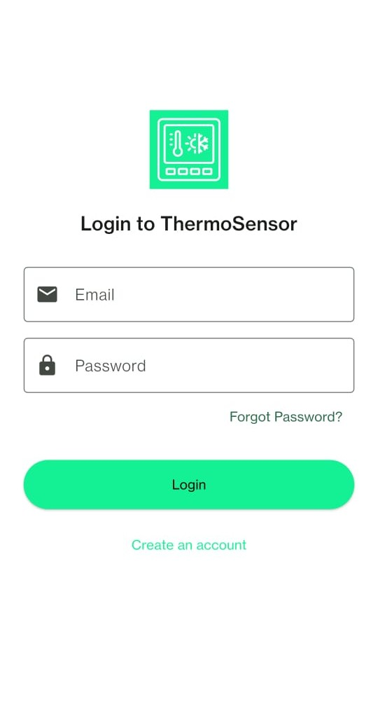
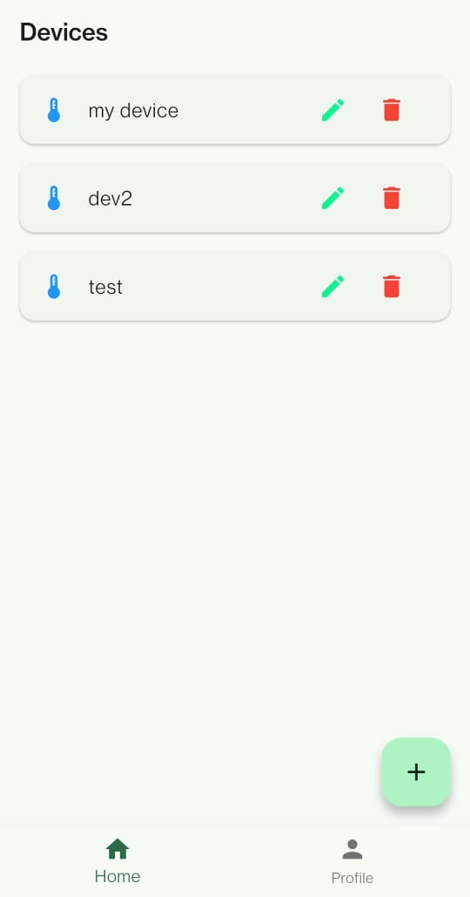
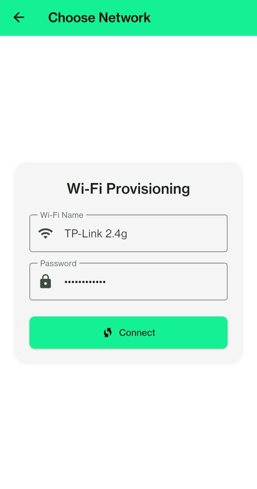
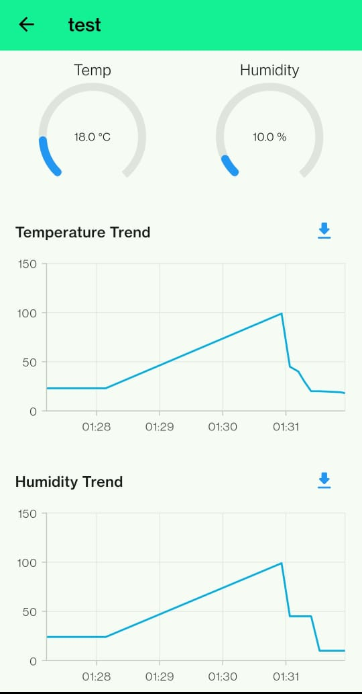

# 🌡️ ThermoSensor – IoT Hygrometer App with Flutter + Firebase + MQTT

A complete **IoT thermostat system** powered by Flutter, Firebase, and MQTT, integrating live sensor data from an ESP8266 Wi-Fi-enabled microcontroller.

 

---

## 🔥 Live YouTube Demo

📺 **[Develop IoT App with Flutter – YouTube Live](https://www.youtube.com/watch?v=wlD_7gDvBYg)**  
🕙 **Join on 19-05-2024 10 PM IST**

---

## 🚀 Features

### 📲 Mobile App (Flutter)
- ✨ Beautiful **Material 3 Themed UI**
- 🔐 Firebase **Login/Register** with password reset
- 📶 **Wi-Fi provisioning flow** to connect ESP8266
- 📋 **Device Manager** (Add, Edit, Delete devices)
- 📊 **Live Dashboard**:
  - Radial gauges for temperature & humidity
  - Line charts for trends (last 10 values)
- 📁 **Export as CSV** from charts
- ☁️ Firebase Realtime DB for syncing per-user device data

 

---

### 🔧 Firmware (ESP8266 – Arduino)
- Supports **Wi-Fi provisioning via mobile app**
- Hosts local HTTP server on `192.168.4.1` in AP mode
- Parses JSON POST request:
  ```json
  {
    "ssid": "YourWiFiName",
    "password": "YourWiFiPassword"
  }
  ```
- Generates random 10-digit `deviceId`, saves it to EEPROM
- Sends temperature & humidity data to public **MQTT broker**
  - Broker: `broker.hivemq.com`
  - Topic format: `deviceId/data`
  - Payload format: `"25.3,60.2"` (temp, humidity)
- Fallback to hotspot if Wi-Fi credentials are invalid
- Reset logic via long-press (to clear EEPROM and re-provision)

---

## 🖼 Screenshots

| Login/Register | Wi-Fi Provisioning | Dashboard |
| -------------- | ------------------ | --------- |
|  |  |  |

---

## 🧰 Tech Stack

- **Flutter 3.19+**
- **Firebase Authentication**
- **Firebase Realtime Database**
- **MQTT via HiveMQ**
- **ESP8266 + DHT22**
- **Syncfusion Charts & Gauges**

---

## 📁 Project Structure

```
lib/
├── auth_page.dart
├── devices.dart
├── home_page.dart
├── profile.dart
├── theme.dart
└── main.dart

firmware/
└── firmware.ino
```

---

## ⚙️ Setup

1. Clone this repo
2. Add your Firebase `google-services.json` and setup Firebase project
3. Flash `firmware/firmware.ino` to ESP8266
4. Run the Flutter app
5. Provision device Wi-Fi using app

---

## 📩 Connect

Have questions or want to collaborate?  
Reach out to me on jigneshk19978@gmail.com
Hire me on Fiverr: [https://www.fiverr.com/iot_guy/develop-an-app-for-your-iot-business](https://www.fiverr.com/iot_guy/develop-an-app-for-your-iot-business)
